# CRABS: Creating Reference databases for Amplicon-Based Sequencing

## 1. Introduction

CRABS (<ins>C</ins>reating <ins>R</ins>eference databases for <ins>A</ins>mplicon-<ins>B</ins>ased <ins>S</ins>equencing) is a versatile software program that generates curated reference databases for metagenomic analysis. CRABS workflow consists of seven modules: (i) download data from online repositories; (ii) import downloaded data into CRABS format; (iii) extract amplicon regions through *in silico* PCR analysis; (iv) retrieve amplicons without primer-binding regions through alignments with *in silico* extracted barcodes; (v) curate and subset the local database via multiple filtering parameters; (vi) export the local database in various formats according to the taxonomic classifier requirements; and (vi) post-processing functions, i.e., visualisations, to explore and provide a summary overview of the local reference database. These seven modules are split into eighteen functions and are described below. Additionally, example code is provided for each of the eighteen functions. Finally, a tutorial to build a local shark reference database for the [MiFish-E primer set](https://royalsocietypublishing.org/doi/10.1098/rsos.150088) is provided at the end of this README document to provide an example script for reference.

## 2. Major update: CRABS *v 1.0.0*

We are excited to announce that CRABS has seen a major update and code redesign based on user feedback, which we hope will improve the user experience of building your very own local reference database!

Please find below a list of features and improvements added to CRABS *v 1.0.0*:

1. increased speed through code optimisation;
2. improved error handling to facilitate easy debugging;
3. altered workflow to improve flexibility (the CRABS format is now used throughout each step and steps can be run in any order);
4. enhanced flexibility by splitting previous functions into multiple steps in case an error occurred mid-way code execution;
5. improved file handling to enable multiple CRABS commands to run concurrently;
6. reduced intermediate file generation to limit storage requirements for local generating reference databases;
7. uniform design within CRABS and between other software programs developed by our team (e.g., [*tombRaider*](https://github.com/gjeunen/tombRaider));
8. reduced number of dependencies by native Python 3 coding and facilitate easy installation;
9. added functionality, including:
   1. split online download and data import;
   2. ability to parse synonym and unaccepted names, thereby incorporating a larger number of sequences and diversity in the final reference database;
   3. extract amplicons through *in silico* PCR analysis in both directions at once;
   4. export the local reference database to BLAST format, thereby enabling blastn and megablast to be run locally;
   5. export the local reference database to IDTAXA format.

CRABS *v 1.0.0* can now be downloaded manually by cloning this GitHub repository (see [4.1 Manual installation](#41-manual-installation) for detailed info). We will update the Docker container and conda package as soon as possible to facilitate easy installation of the newest version.

## 3. Citation

When using CRABS in your research projects, please cite the following paper:

```{highlight}
[Jeunen, G.-J., Dowle, E., Edgecombe, J., von Ammon, U., Gemmell, N. J., & Cross, H. (2022). crabs—A software program to generate curated reference databases for metabarcoding sequencing data. Molecular Ecology Resources, 00, 1– 14.](https://doi.org/10.1111/1755-0998.13741)
```

## 4. Installing CRABS

CRABS is a command-line only toolkit running on typical Unix/Linux environments and is exclusively written in python3. However, CRABS makes use of the *subprocess* module in python to run several commands in bash syntax to circumvent python-specific idiosyncrasies and increase execution speed. We provide three ways to install CRABS. For the most up-to-date version of CRABS, we recommend the manual installation by cloning this GitHub repository and installing 10 dependencies separately (installation instructions for all dependencies provided in [4.1 Manual installation](#41-manual-installation)). CRABS can also be installed via Docker and conda. Both methods allow for easy installation by automatically co-installing all dependencies. We aim to keep the Docker container and conda package up-to-date, though a certain delay to update to the newest version can occur, especially for the conda package. Below are details for all three approaches.

### 4.1 Manual installation

For the manual installation, first clone the CRABS repository. This step requires GitHub to be available to the command line ([installation instructions for GitHub](https://cli.github.com/)).

```{code-block} bash
git clone https://github.com/gjeunen/reference_database_creator.git
```

Depending on your settings, CRABS might need to be made executable on your system. This can be achieved using the code below.

```{code-block} bash
chmod +x reference_database_creator/crabs
```

Once CRABS is installed, we need to ensure all dependencies are installed and globally accessible. The latest version of CRABS (version *v 1.0.0*) runs on Python 3.11.7 (or any compatible version to 3.11.7) and relies on five Python modules that might not come standard with Python, as well as five external software programs. All dependencies are listed below, together with a link to the installation instructions. The version numbers provided for each module and software program are the ones CRABS was developed on. Though compatible versions of each could be used as well.

**Python modules:**

1. *requests v 2.32.3* - [A Python library for making HTTP requests.](https://pypi.org/project/requests/)
2. *rich v 13.3.5* - [A Python library for beautiful terminal formatting.](https://pypi.org/project/rich/)
3. *rich-click v 1.7.2* - [A Python library that extends Click to provide rich formatting for command-line interfaces.](https://pypi.org/project/rich-click/)
4. *matplotlib v 3.8.0* - [A plotting library used for creating static, animated, and interactive visualizations.](https://pypi.org/project/matplotlib/)
5. *numpy v 1.26.2* - [A library for working with arrays and numerical operations.](https://pypi.org/project/numpy/)

**External software programs:**

1. *makeblastdb v 2.10.1+* - [A tool from the BLAST+ suite for creating BLAST databases.](https://www.ncbi.nlm.nih.gov/books/NBK569861/)
2. *cutadapt v 4.4* - [A tool for trimming adapter sequences from high-throughput sequencing reads.](https://pypi.org/project/cutadapt/)
3. *vsearch v 2.16.0* - [A tool for metagenomics data analysis and high-throughput sequencing data analysis.](https://formulae.brew.sh/formula/vsearch)
4. *clustalw2 v 2.1* - [A tool for multiple sequence alignments.](https://anaconda.org/bioconda/clustalw)
5. *FastTree v 2.1.11* - [A tool for inferring approximately maximum-likelihood phylogenetic trees.](https://anaconda.org/bioconda/fasttree)

Once CRABS and all the dependencies are installed, CRABS can be made accessible throughout the OS using the code below.

```{code-block} bash
export PATH="/path/to/crabs/folder:$PATH"
```

Substitute */path/to/crabs/folder* with the actual path to the GitHub repository folder on the OS, i.e, the folder created during the `git clone` command above. Adding the `export` code to the *.bash_profile* or *.bashrc file* will make CRABS globally accessible at any time.

### 4.2 Docker container

Docker is an open-source project that allows for deployment of software applications inside 'containers' that are isolated from your computer and run through a virtual host operating system called Docker Engine. The main advantage of running docker over virtual machines is that they use much less resources. This isolation means that you can run a Docker container on most operating systems, including Mac, Windows, and Linux. You may need to set up a free account to use Docker Desktop. This [**link**](https://docker-curriculum.com/) has a nice introduction to the basics of using Docker. [**Here**](https://docs.docker.com/get-started/) is a link to get you started and oriented to the Docker multiverse.

There are only two steps to get the Crabs running on your computer. First, install Docker Desktop on your computer, which is free for most users. [**Here are the instructions for Mac**](https://docs.docker.com/desktop/install/mac-install/);  [**here are the instructions for Windows computers**](https://docs.docker.com/desktop/install/windows-install/), and [**here are the instructions for Linux**](https://docs.docker.com/desktop/install/linux-install/) (most major Linux platforms are supported). Once you have Docker Desktop installed and running (the Desktop application must be running for you to use any docker commands on the command line), you just have to 'pull' our Crabs image, and you are ready to go:

```{code-block} bash
docker pull quay.io/swordfish/crabs:1.9.0.0
```

While the installation of a docker application is easy, using those applications can be a little tricky at first. To help you get started we have provided some example commands using the docker version of crabs. These [**examples can be found in the docker_intro folder on this repo**](docker_intro/README.md). From these examples you should be able to run through setting up an entire reference database and be ready to go. We will continue to expand on these examples and test this in many different situations. Please ask questions and provide feedback in the Issues tab.

### 4.3 Conda package

To install the conda package, you must first install conda. See this [link](https://docs.conda.io/projects/conda/en/latest/user-guide/install/index.html) for details. If conda is already installed, it is good practice to update the conda tool with `conda update conda` before installing CRABS.

Once conda is installed, follow the steps below to install CRABS and all dependencies. Make sure to enter the commands in the order they appear below.

```{code-block} bash
conda create -n CRABS
conda activate CRABS
conda config --add channels bioconda
conda config --add channels conda-forge
conda install -c bioconda crabs
```

Once you have entered the install command, conda will process the request (this might take a minute or so), and then display all the packages and programs that will be installed, and ask to confirm this. Type `y` to start the installation. After this finishes, CRABS should be ready to go.

We have tested this installation on Mac and Linux systems. We have not yet tested on Windows Subsystem for Linux (WSL).

### 4.4 Check the installation

Use the code below to check if CRABS is successfully installed and pull up the help information.

```bash
crabs -h
```

The help information splits the eighteen functions into different groups, with each group listing the function at the top and the required and optional parameters underneath.

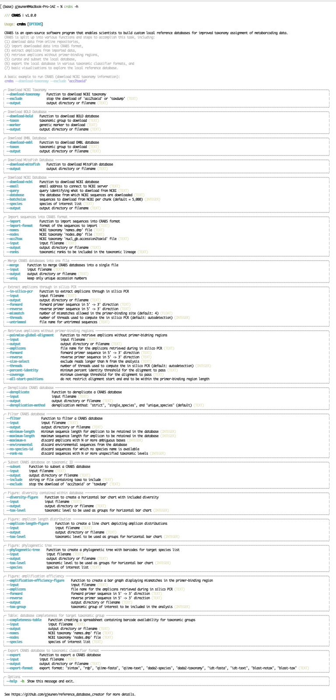

## 5. CRABS workflow

CRABS contains seven modules, which incorporate twenty one functions:

**Module 1:** download data from online repositories

1. `--download-taxonomy`: download [NCBI taxonomy](https://www.ncbi.nlm.nih.gov/taxonomy) information;
2. `--download-bold`: download sequence data from the [Barcode of Life Database (BOLD)](https://www.boldsystems.org/);
3. `--download-embl`: download sequence data from the [European Nucleotide Archive (ENA; EMBL)](https://www.ebi.ac.uk/ena/browser/home);
4. `--download-greengenes`: download sequence data from the [GreenGenes database](https://greengenes.lbl.gov/Download/Sequence_Data/Fasta_data_files/);
5. `--download-mitofish`: download sequence data from the [MitoFish database](https://mitofish.aori.u-tokyo.ac.jp/);
6. `--download-ncbi`: download sequence data from the [National Center for Biotechnology Information (NCBI)](https://www.ncbi.nlm.nih.gov/);
7. `--download-midori`: download sequence data from the [MIDORI and MIDORI2 databases](https://www.reference-midori.info/download.php);
8. `--download-silva`: download sequence data from the [SILVA database](https://ftp.arb-silva.de/).

**Module 2:** import downloaded data into CRABS format

9. `--import`: import downloaded sequences or custom barcodes into CRABS format;
10. `--merge`: merge different CRABS-formatted files into a single file.

**Module 3:** extract amplicon regions through *in silico* PCR analysis

11. `--in-silico-pcr`: extract amplicons from downloaded data by locating and removing primer-binding regions.

**Module 4:** retrieve amplicons without primer-binding regions

12. `--pairwise-global-alignment`: retrieve amplicons without primer-binding regions by aligning downloaded sequences to *in silico* extracted barcodes.

**Module 5:** curate and subset the local database via multiple filtering parameters

13. `--dereplicate`: discard duplicate sequences;
14. `--filter`: discard sequences via multiple filtering parameters;
15. `--subset`: subset the local database to retain or exclude specified taxonomic groups.

**Module 6:** export the local database

16. `--export`: export the CRABS-formatted database to various formats according to the requirements of the taxonomic classifier to be used.

**Module 7:** post-processing functions to explore and provide a summary overview of the local reference database

17. `--diversity-figure`: creates a horizontal bar chart displaying the number of species and sequences group per specified level included in the reference database;
18. `--amplicon-length-figure`: creates a line chart depicting amplicon length distributions separated by taxonomic group;
19. `--phylogenetic-tree`: creates a phylogenetic tree with barcodes from the reference database for a target list of species;
20. `--amplification-efficiency-figure`: creates a bar graph displaying mismatches in the primer-binding regions;
21. `--completeness-table`: creates a spreadsheet containing barcode availability for taxonomic groups.

### 5.1 Module 1: download data from online repositories

Initial sequencing data can be downloaded by CRABS from four online repositories, including (i) [BOLD](https://www.boldsystems.org/), (ii) [EMBL](https://www.ebi.ac.uk/ena/browser/home), (iii) [MitoFish](https://mitofish.aori.u-tokyo.ac.jp/), and [NCBI](https://www.ncbi.nlm.nih.gov/). From version *v 1.0.0* onwards, the downloading of data from each repository is split up into its own function. Additionally, CRABS does not automatically format the data after downloading to increase flexibility and enable debugging when the download of data fails.

Besides downloading sequence data, CRABS is also capable of downloading the NCBI taxonomy information, which CRABS uses for creating the taxonomic lineage for each sequence.

#### 5.1.1 `--download-taxonomy`

To assign a taxonomic lineage to each downloaded sequence in the reference database (see [5.2 Module 2](#52-module-2-import-downloaded-data-into-crabs-format)), the taxonomic information needs to be downloaded. CRABS utilizes NCBI's taxonomy and downloads three specific files to your computer: (i) a file linking accession numbers to taxonomic IDs (*nucl_gb.accession2taxid*), (ii) a file containing information about the phylogenetic name associated with each taxonomic ID (*names.dmp*), and (iii) a file containing information how taxonomic IDs are linked (*nodes.dmp*). The output directory for the downloaded files can be specified using the `--output` parameter. To exclude either file *nucl_gb.accession2taxid* or files *names.dmp* and *nodes.dmp*, the `--exclude acc2tax` or `--exclude taxdump` parameter can be provided, respectively. The first code below does not download any file, as both `acc2tax` and `taxdump` are provided for the `--exclude` parameter. The second line of code downloads all three files to the subdirectory `--output crabs_testing`. The screenshot underneath displays what is printed to the console when executing this line of code.

```{code-block} bash
crabs --download-taxonomy --exclude 'acc2taxid,taxdump'
crabs --download-taxonomy --output crabs_testing
```

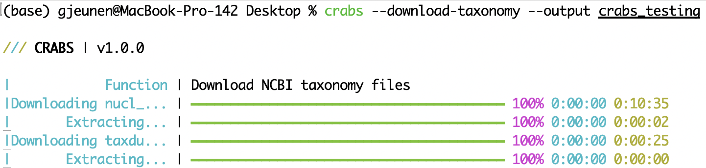

#### 5.1.2 `--download-bold`

From version 1.10.0 onwards, CRABS downloads BOLD sequences from the [V5 portal](http://v3.boldsystems.org/index.php/API_Public/) instead of the V3 portal in previous versions. The output file is structured as a tab-delimited tsv document, which can be specified using the `--output` parameter. Users can specify which taxonomic group to download using the `--taxon` parameter. We recommend writing a simple for loop (example provided below) when users want to download multiple taxonomic groups, thereby limiting the amount of data to be downloaded from BOLD per instance. Unlike when CRABS downloads from the V3 portal, CRABS automatically checks and reports if the taxonomic group name is correct and available for download.

**Recommended approach:** A simple for loop to download data from BOLD for multiple taxonomic groups (recommended approach). The code below first downloads data for Elasmobranchii, followed by sequences assigned to Mammalia. Downloaded data will be written to the subdirectory `--output crabs_testing` and placed in two separate files, indicating which data belongs to which taxonomic group, i.e., `crabs_testing/bold_Elasmobranchii.fasta` and `crabs_testing/bold_Mammalia.fasta`.

```{code-block} bash
for taxon in Elasmobranchii Mammalia; do crabs --download-bold --taxon ${taxon} --output crabs_testing/bold_${taxon}.tsv; done
```

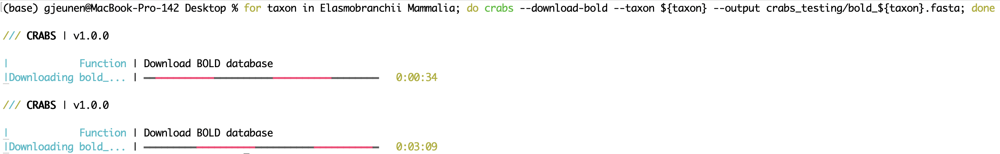

To keep the functionality of earlier versions, CRABS is still able to download BOLD sequences from the [V3 portal](http://v3.boldsystems.org/index.php/resources/api?type=webservices#sequenceParameters) when specifying the `--version-v3` flag. The output file, which is structured as a two-line fasta document, can be specified using the `--output` parameter. Users can specify which taxonomic group to download using the `--taxon` parameter. We recommend writing a simple for loop (example provided below) when users want to download multiple taxonomic groups, thereby limiting the amount of data to be downloaded from BOLD per instance. However, if only a limited number of taxonomic groups are of interest, taxonomic group names can also be separated by `|` (example provided below). We also recommend users to check if the taxonomic group name to be downloaded is listed within the [BOLD archive](http://v3.boldsystems.org/index.php/resources/api?type=webservices#sequenceParameters) or if alternative names need to be used. For example, specifying `--taxon Chondrichthyes` will not download all cartilaginous fish sequences from BOLD, since this class name is not listed on BOLD. Users should rather use `--taxon Elasmobranchii` in this instance. Users can also specify to limit the download to a specific genetic marker by providing the `--marker` parameter. When multiple genetic markers are of interest, marker names should be separated by `|`. The four main DNA barcoding markers on BOLD are **COI-5P**, **ITS**, **matK**, and **rbcL**. Input for the `--marker` parameter is case sensitive.

**Alternative option:** Besides the recommended for loop, multiple taxon names can be provided at once by separating the names using `|`.

```{code-block} bash
crabs --download-bold --taxon 'Elasmobranchii|Mammalia' --output crabs_testing/bold_elasmobranchii_mammalia.fasta --version-v3
```

#### 5.1.3 `--download-embl`

Sequences from EMBL are downloaded through the [HTTPS website](https://ftp.ebi.ac.uk/pub/databases/ena/sequence/con-std_latest/std/) rather than the FTP server from CRABS v 1.7.4 onwards. This change was implemented for additional security, speed, and flexibility.

EMBL files will first be downloaded in a '.fasta.gz' format and be automatically unzipped once the download is complete. The output directory and file name can be specified using the `--output` parameter.

This database does not provide as much flexibility with regards to selective downloading compared to BOLD or NCBI. Rather, EMBL data is structured into 15 tax divisions, which can be downloaded separately or together.

A list of all 15 tax division options is provided below.

**List of tax divisions:**

1. ENV: environmental
2. FUN: fungi
3. HUM: human
4. INV: invertebrate
5. MAM: mammal
6. MUS: mouse
7. PHG: phage
8. PLN: plant
9. PRO: prokaryote
10. ROD: rodent
11. SYN: synthetic
12. TGN: pathogen
13. UNC: unclassified
14. VRL: viral
15. VRT: vertebrate

The tax division to download can be specified using the `--taxon` parameter. From CRABS v 1.7.4, python regex support, through the re package, is provided for the `--taxon` parameter. This allows more flexibility, by enabling the download of specific file(s), a range of files, or all files in the EMBL database Since regex can be tricky to write, we have provided some examples below.

First off, a list of all EMBL samples can be found on [this link](https://ftp.ebi.ac.uk/pub/databases/ena/sequence/con-std_latest/std/). CRABS downloads the ".fasta.gz" files with file names that start with "STD_" (scroll down quite far in the list to find the samples). The `--taxon` parameter requires users to provide the tax division to download (as written in the file list, i.e, in capital), as well as the file number. Multiple files exist for each tax division, as the EMBL database files only contain 100,000 sequences each. Hence, when more sequences are deposited, a new file will be created. This is also the reason why files have different sizes, which will influence required download time, as it is dependent on the sequence length of the 100,000 references contained within the file.

The easiest option for the `--taxon` parameter is to download a single file. This requires the user to provide the exact tax division and file number. For example, the code below can be used to download the **third mammal file**. Note that you only have to provide `--taxon 'MAM_3'` and not the prefix "STD_" and suffix ".fasta.gz", as these are automatically appended by CRABS.

```{code-block} bash
crabs --download-embl --taxon 'MAM_3' --output embl_mam_3.fasta
```

The second easiest option for the `--taxon` parameter is to download to full EMBL database. You can use the code below to accomplish this. Please note that the EMBL database is very large. Hence, downloading the full database is not recommended, as it requires a long time and a vast amount of available disk space.

```{code-block} bash
crabs --download-embl --taxon '.*' --output embl_all.fasta
```

Next, we can use regex patterns to download a specific list of files. The example below can be used to download the fourth, sixth, and nineth file of the mammal tax division.

```{code-block} bash
crabs --download-embl --taxon 'MAM_(4|6|9)' --output embl_mam_4_6_9.fasta
```

Besides a specific list, we can use regex to download a range of files. The example below can be used to download the 77th until the 80th file of the viral tax devision.

```{code-block} bash
crabs --download-embl --taxon 'VRL_(7[7-9]|80)' --output embl_VRL_77_80.fasta 
```

If you'd want to download all files of a tax division, you can use the following regex pattern.

```{code-block} bash
crabs --download-embl --taxon 'MAM_\d+\' --output embl_MAM_all.fasta 
```

A final example we will provide is a way to download all files of multiple tax divisions, such as the mammal and vertebrate ones.

```{code-block} bash
crabs --download-embl --taxon '(MAM|VRT)_\d+\' --output embl_MAM_VRT_all.fasta
```

We hope that these examples will enable you to download the portion of the EMBL database you need with ease using CRABS.

#### 5.1.4 `--download-greengenes`

The GreenGenes database are downloaded through the [dedicated website](https://greengenes.lbl.gov/Download/Sequence_Data/Fasta_data_files/). CRABS only requires an output file name in fasta format, which can be provided using the `--output` parameter. The GreenGenes database is split into 6 files, which CRABS will download and merge into a single output file.

```{code-block} bash
crabs --download-greengenes --output greengenes.fasta
```

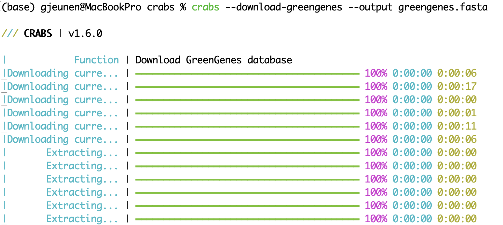

#### 5.1.5 `--download-greengenes2`

The GreenGenes2 database is downloaded through the [dedicated website](https://ftp.microbio.me/greengenes_release/current/). CRABS only requires an output file name in fasta format, which can be provided using the `--output` parameter.

```{code-block} bash
crabs --download-greengenes2 --output greengenes2.fasta
```


#### 5.1.6 `--download-midori`

The MIDORI and MIDORI2 databases can be downloaded through the [dedicated website](https://www.reference-midori.info/download.php). Since multiple database versions, gene regions, and database types are available, CRABS requires some specific information to download the correct version. This information can be passed through using the `--gb-number` (MIDORI database number and date in the format of "XXX_YYYY-MM-DD"; supported database versions range currently between 237_2020-04-18 and 264_2024-12-14; note that new database versions will be automatically supported by CRABS until format changes occur), `--gene` (the gene region of the sequence data; MIDORI currently splits databases into 14 gene regions, including A6, A8, CO1, CO2, CO3, Cytb, ND1, ND2, ND3, ND4, ND5, ND6, lrRNA, and srRNA), and `--gb-type` (MIDORI database type, including "longest", "total", and "uniq") parameters. The easiest way to determine the values for these parameters is to visit the [website](https://www.reference-midori.info/download.php). Besides these specific parameters, the output folder and file can be specified using the `--output` parameter. The screenshot below indicates where all information can be found on the MIDORI website.


When using the MIDORI database to generate your own local reference database, please make sure to cite the relevant literature as described on the MIDORI2 website.

```{code-block} bash
crabs --download-midori --output cytb_total_264.fasta --gb-number 264_2024-12-14 --gene Cytb --gb-type total
```

#### 5.1.7 `--download-mitofish`

CRABS can also download the [MitoFish database](http://mitofish.aori.u-tokyo.ac.jp). This database is a single two-line fasta file. The output directory and file name can be specified using the `--output` parameter.

```{code-block} bash
crabs --download-mitofish --output crabs_testing/mitofish.fasta
```

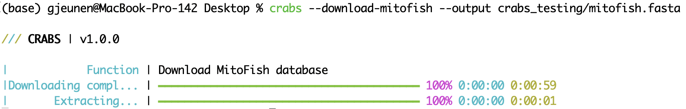

#### 5.1.8 `--download-ncbi`

Sequences from the [NCBI database](https://www.ncbi.nlm.nih.gov/) are downloaded through the [Entrez Programming Utilities](https://www.ncbi.nlm.nih.gov/books/NBK25497/). NCBI allows the downloading of data from various databases, which users can specify with the `--database` parameter. For most users, the `--database nucleotide` database will be most appropriate for building a local reference database.

To specify the data to be downloaded from NCBI, users provide a search through the `--query` parameter. Crafting good NCBI searches can be difficult. A good way to build a search query is to use the [NCBI webpage search window](https://www.ncbi.nlm.nih.gov/nucleotide/). From [this link](https://www.ncbi.nlm.nih.gov/nucleotide/), first do an initial search and press enter. This will bring you to the results page where you can further refine your search. In the screenshot below, we've further refined the search by limiting sequence length between 100 - 25,000 bp and only incorporating mitochondrial sequences. Users can copy-paste the text in the "Search details" box on the website and provide it in quotes to the `--query` parameter. Another benefit of using the NCBI webpage search window is that the webpage will display how many sequences match your search query, which should match the number of sequences reported by CRABS. [This webpage]((https://otagomohio.github.io/hacky2021/sessions/1005_ncbi/)) provides a further short tutorial on using the search function on the NCBI webpage that our team has written for extra information.

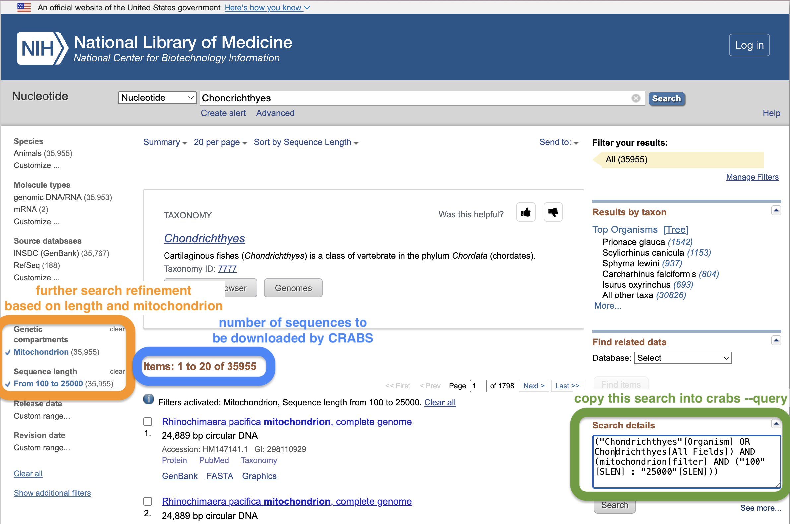

Besides the search query (`--query`), users can further restrict the search term by downloading sequence data for a list of species using the `--species` parameter. The `--species` parameter either takes an input string of species names separated by `+` or an input .txt file with a single species name per line in the document. The `--batchsize` parameter provides users the option to download sequences in batches of N from the NCBI website. This parameter defaults to 5,000. It is not recommended to increase this value above 5,000, as the NCBI servers will most likely disconnect the download if too many sequences are downloaded at once. The `--email` parameter allows users to specify their email address, which is required to access the NCBI servers. Finally, the output directory and filename can be specified using the `--output` parameter.

```{code-block} bash
crabs --download-ncbi --query '("Chondrichthyes"[Organism] OR Chondrichthyes[All Fields]) AND (mitochondrion[filter] AND ("100"[SLEN] : "25000"[SLEN]))' --output crabs_testing/ncbi_chondrichthyes.fasta --email johndoe@gmail.com --database nucleotide
```


#### 5.1.9 `--download-silva`

The fasta version of the [SILVA database](https://ftp.arb-silva.de/) is downloaded through the dedicated FTP server. SILVA allows the downloading of different versions of the database, which users can specify with the `--db-version` parameter. As of writing, the latest version is 138.2. Besides versions, the SILVA database is also split up in two different gene regions, including one database containing the 16S/18S ribosomal RNA sequences (`--gene SSU`) and one database containing the 23S/28S ribosomal RNA sequences (`--gene LSU`). Finally, databases can be downloaded in full (`--db-type full`) or subsetted based on a 99% criterion applied to remove redundant sequences (`--db-type subset`). More information about the databases can be found on [SILVA's website](https://www.arb-silva.de/download/arb-files/).

When providing incorrect values to any of the parameters, CRABS will provide proper HTTP error reporting for debugging (see screenshot below).

```{code-block} bash
crabs --download-silva --output silva_138.2_LSU_subset.fasta --gene LSU --db-type subset --db-version 138.2
```

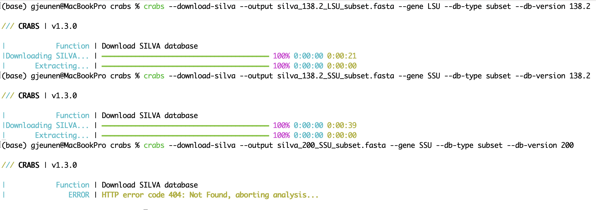

#### 5.1.10 Downloading the UNITE database

The current version of CRABS does not support the direct download of the [UNITE database](https://unite.ut.ee/repository.php), as it is stored via a DOI link requiring user authentication. Until we resolve this issue, we recommend downloading the UNITE database directly from the website using this [link](https://unite.ut.ee/repository.php). Below is a step-by-step instruction to download different versions of the UNITE database. While CRABS cannot currently download the UNITE database, CRABS can import the UNITE database using the code below.

```{code-block} bash
crabs --import --import-format unite --input sh_general_release_dynamic_04.04.2024.fasta --acc2tax nucl_gb.accession2taxid --names names.dmp --nodes nodes.dmp --output unite_general_04_04_2024.txt
```

We recommend downloading the "General FASTA release" or the "Full UNITE+INSD dataset" versions of the UNITE database using [this link](https://unite.ut.ee/repository.php).

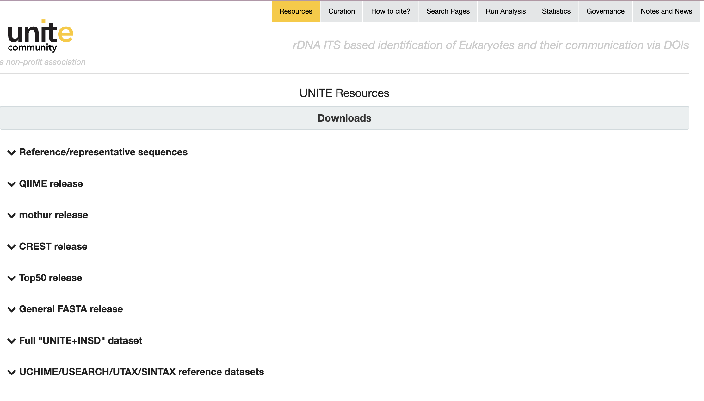

Click on the dropdown menu and select the database version you would like to download.

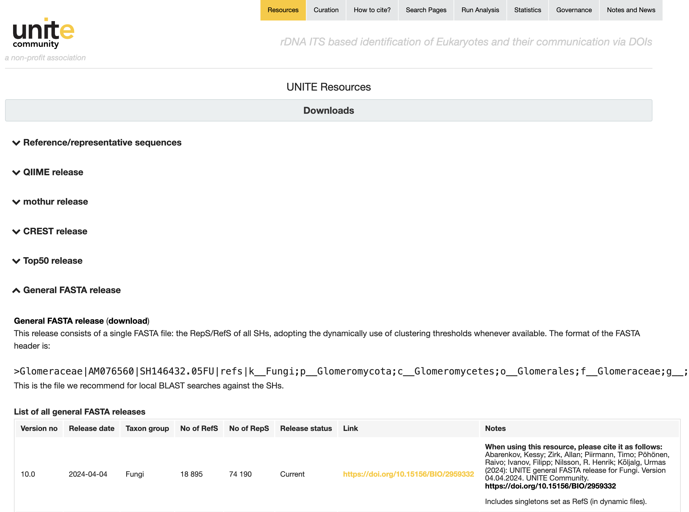

Clicking on the DOI link will open a new browser window. The database will be downloaded by clicking on the link at the bottom of this page ("sh_general_realease_04.04.2024.tgz" in the screenshot below) and after filling out the information of the pop up window.

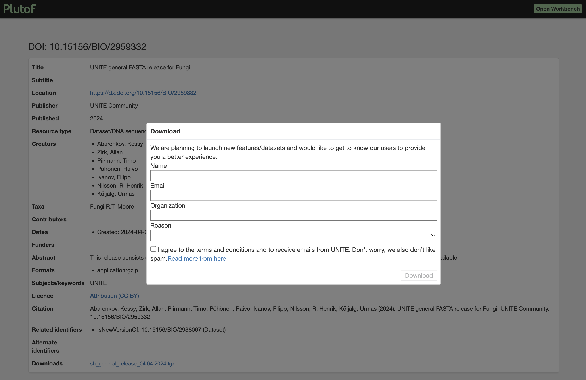

Before importing the UNITE database into CRABS, you need to unzip the downloaded file, which can be accomplished using the code below:

```{code-block} bash
tar -xvzf sh_general_release_04.04.2024.tgz
```

The UNITE database can then be imported into CRABS using the following code:

```{code-block} bash
crabs --import --import-format unite --input sh_general_release_dynamic_04.04.2024.fasta --acc2tax nucl_gb.accession2taxid --names names.dmp --nodes nodes.dmp --output unite_general_04_04_2024.txt
```

### 5.2 Module 2: import downloaded data into CRABS format

#### 5.2.1 `--import`

Once the data from online repositories are downloaded, files will need to be imported into CRABS using the `--import` function. CRABS format constitutes a single tab-delimited line per sequence containing all information, including (i) sequence ID, (ii) taxonomic name parsed from the initial download, (iii) NCBI taxon ID number, (iv) taxonomic lineage according to NCBI taxonomy, and (v) the sequence. CRABS will try to obtain the NCBI accession number for each sequence as a sequence ID. If the sequence does not contain an accession number, i.e., it is not deposited on NCBI, CRABS will generate unique sequence IDs using the following format: `crabs_*[num]*_taxonomic_name`. The format of the input document is specified using the `--import-format` parameter and specifies the name of the repository from which the data was downloaded, i.e., **BOLDV3**, **BOLDV5**, **EMBL**, **GreenGenes**, **MIDORI**, **MITOFISH**, **NCBI**, **SILVA**, or **UNITE**. The taxonomic lineage CRABS creates is based on the NCBI taxonomy and CRABS requires the three files downloaded using the `--download-taxonomy` function, i.e., `--names`, `--nodes`, and `--acc2tax`. From version *v 1.0.0*, CRABS is capable of resolving synonym and unaccepted names to incorporate a larger number of sequences and diversity in the local reference database. The taxonomic ranks to be included in the taxonomic lineage can be specified using the `--ranks` parameters. While any taxonomic rank can be included, we recommend using the following input to include all necessary information for most taxonomic classifiers `--ranks 'superkingdom;phylum;class;order;family;genus;species'`. The output file can be specified using the `--output` parameter and is a simple .txt file. In the Terminal Window, CRABS prints the results of the number of sequences imported, as well as any sequences for which no taxonomic lineage could be generated.

```{code-block} bash
crabs --import --import-format boldv5 --input crabs_testing/bold_Elasmobranchii.tsv --names crabs_testing/names.dmp --nodes crabs_testing/nodes.dmp --acc2tax crabs_testing/nucl_gb.accession2taxid --output crabs_testing/crabs_bold.txt --ranks 'superkingdom;phylum;class;order;family;genus;species'
```

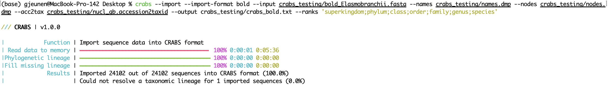

#### 5.2.2 `--merge`

When sequence data from multiple online repositories are downloaded, files can be merged into a single file after importing (see [5.2.1 `--import`](#521---import)) using the `--merge` function. Input files to merge can be entered using the `--input` parameter, with files separated by `;`. It is possible that a sequence was downloaded multiple times when deposited on various online repositories. Using the `--uniq` parameter retains only a single version of each accession number. The output file can be specified using the `--output` parameter. In the Terminal Window, CRABS prints the results of the number of sequences merged, as well as the number of sequences retained when using the `--uniq` parameter.

```{code-block} bash
crabs --merge --input 'crabs_testing/crabs_bold.txt;crabs_testing/crabs_mitofish.txt;crabs_testing/crabs_ncbi.txt' --uniq --output crabs_testing/merged.txt
```

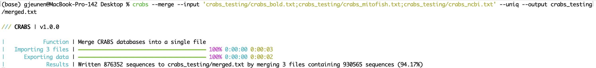

### 5.3 Module 3: extract amplicon regions through *in silico* PCR analysis

CRABS extracts the amplicon region of the primer set by conducting an *in silico* PCR (function: `--in-silico-pcr`). CRABS uses [cutadapt *v 4.4*](https://pypi.org/project/cutadapt/) for the *in silico* PCR to increase speed of execution of traditional python code. Input and output file names can be specified using the '*--input*' and '*--output*' parameters, respectively. Both the forward and reverse primer should be provided in 5'-3' direction using the '*--forward*' and '*--reverse*' parameters, respectively. CRABS will reverse complement the reverse primer. From version *v 1.0.0*, CRABS is capable of retaining barcodes in both direction using a single *in silico* PCR analysis. Hence, no reverse complementation step and rerunning of the *in silico* PCR is conducted, thereby significantly increasing execution speed. To retain sequences for which no primer-binding regions could be found, an output file can be specified for the `--untrimmed` parameter. The maximum allowed number of mismatches found in the primer-binding regions can be specified using the `--mismatch` parameter, with a default setting of 4. Finally, the *in silico* PCR analysis can be multithreaded in CRABS. By default the maximum number of threads are being used, but users can specify the number of threads to use with the `--threads` parameter.

```{code-block} bash
crabs --in-silico-pcr --input crabs_testing/merged.txt --output crabs_testing/insilico.txt --forward GACCCTATGGAGCTTTAGAC --reverse CGCTGTTATCCCTADRGTAACT
```

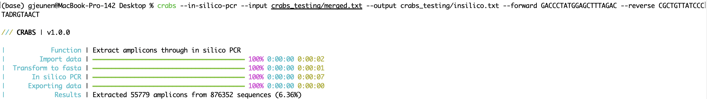

**Please note:** cutadapt will crash when it opens more files than the system limit allows for. These files are opened during processing. This error can occur when setting the thread count too high or when processing large sequences, such as full genomes. CRABS v 1.7.1 will now properly report this error, which will be displayed as the screenshot below.


When encountering this error, we recommend you try to either reduce the number of threads using the `--threads` parameter or increase the limit of the number of open files within your system. For Linux and MacOS users, the limit of open files can be viewed and increased using the code below.

```{code-block} bash
ulimit -n
ulimit -n XXX # where XXX is an INT higher than the current limit
```

#### 5.3.1 parameter `--relaxed`

As of CRABS v 1.8.0, parameter `--relaxed` can be specified. When used, CRABS will rerun the *in silico* PCR analysis after the first attempt, but now by only checking the presence of a single primer-binding region. If either the forward or reverse primer-binding region is found in this second attempt, the amplicon will be added to the `--output` file. This setting can be useful for amplicons where either the forward or reverse primer is commonly used as a barcoding primer.

For example, a ~313 bp fragment of the COI gene is frequently amplified in metabarcoding studies ([Leray et al., 2013](https://frontiersinzoology.biomedcentral.com/articles/10.1186/1742-9994-10-34)). While the forward primer (mlCOIintF: 5'-GGWACWGGWTGAACWGTWTAYCCYCC-3') was newly designed in this study, the reverse primer is the standard universal reverse primer for COI barcoding (jgHCO2198: 5'-TAIACYTCIGGRTGICCRAARAAYCA-3'). Hence, when downloading COI sequencing data from online repositories, most barcodes will not contain the reverse primer-binding region. So, when we conduct the standard `--in-silico-pcr` analysis on 8,008,518 sequences downloaded from BOLD, we only managed to extract 262,165 (3.27%) amplicons.

```{code-block} bash
crabs --in-silico-pcr --input bold.txt --output bold_strict.txt --forward GGWACWGGWTGAACWGTWTAYCCYCC --reverse TAIACYTCIGGRTGICCRAARAAYCA
```

```{admonition}
/// CRABS | v1.8.0

|            Function | Extract amplicons through in silico PCR
|         Import data | ━━━━━━━━━━━━━━━━━━━━━━━━━━━━━━━━━━━━━━━━ 100% 0:00:00 0:00:15
|  Transform to fasta | ━━━━━━━━━━━━━━━━━━━━━━━━━━━━━━━━━━━━━━━━ 100% 0:00:00 0:00:11
|       In silico PCR | ━━━━━━━━━━━━━━━━━━━━━━━━━━━━━━━━━━━━━━━━ 100% 0:00:00 0:01:41
|      Exporting data | ━━━━━━━━━━━━━━━━━━━━━━━━━━━━━━━━━━━━━━━━ 100% 0:00:00 0:00:00
|             Results | Extracted 262165 amplicons from 8008518 sequences (3.27%)
```

However, when we set the `--relaxed` parameter, which enables the extraction of the amplicons by just the forward primer in this instance, CRABS managed to extract 6,639,131 (82.9%) amplicons.

```{code-block} bash
crabs --in-silico-pcr --input bold.txt --output bold_relaxed.txt --forward GGWACWGGWTGAACWGTWTAYCCYCC --reverse TAIACYTCIGGRTGICCRAARAAYCA --relaxed
```

```{admonition}
/// CRABS | v1.8.0

|            Function | Extract amplicons through in silico PCR
|         Import data | ━━━━━━━━━━━━━━━━━━━━━━━━━━━━━━━━━━━━━━━━ 100% 0:00:00 0:00:15
|  Transform to fasta | ━━━━━━━━━━━━━━━━━━━━━━━━━━━━━━━━━━━━━━━━ 100% 0:00:00 0:00:07
|       In silico PCR | ━━━━━━━━━━━━━━━━━━━━━━━━━━━━━━━━━━━━━━━━ 100% 0:00:00 0:01:31
| Transform untrimmed | ━━━━━━━━━━━━━━━━━━━━━━━━━━━━━━━━━━━━━━━━ 100% 0:00:00 0:00:26
|      relaxed IS PCR | ━━━━━━━━━━━━━━━━━━━━━━━━━━━━━━━━━━━━━━━━ 100% 0:00:00 0:01:37
|      Exporting data | ━━━━━━━━━━━━━━━━━━━━━━━━━━━━━━━━━━━━━━━━ 100% 0:00:00 0:00:12
|             Results | Extracted 6639131 amplicons from 8008518 sequences (82.9%)
|             Results | 6376966 amplicons were extracted by only the forward or reverse primer (96.05%)
```

At this point, we recommend only providing the `--relaxed` parameter when one of the two primers is known to be used for barcoding until further simulations are conducted.

#### 5.3.2 parameter `--buffer-size`

As of CRABS v 1.9.0, the parameter `--buffer-size` can be provided to the `--in-silico-pcr` function. This parameter is only required when an "**OverflowError: FASTA/FASTQ record does not fit into buffer, aborting analysis...**" is observed. This error will likely only occur when CRABS tries to process very long sequences, such as genomes. The value for `--buffer-size` should be 2 times the length of the longest sequence in the `--input` file. More information on the specific error can be found in this [GitHub post](https://github.com/marcelm/cutadapt/issues/783).

To find the longest sequence in a CRABS-formatted document, you can use the following line of code (please change '**your_file.txt**' to your actual file name).

```{code-block} bash
awk -F'\t' '{ print length($NF) }' your_file.txt | sort -nr | head -n 1
```

To calculate the number for the `--buffer-size` parameter, you can use the following line of code (please change '**your_file.txt**' to your actual file name), i.e., simply multiplying length by 2.

```{code-block} bash
awk -F'\t' '{ print length($NF) }' your_file.txt | sort -nr | head -n 1 | awk '{ print $1*2 }'
```

Example for `--buffer-size`:

```{code-block} bash
crabs --in-silico-pcr --input bold.txt --output bold_relaxed.txt --forward GGWACWGGWTGAACWGTWTAYCCYCC --reverse TAIACYTCIGGRTGICCRAARAAYCA --relaxed --buffer-size 40000000
```

### 5.4 Module 4: retrieve amplicons without primer-binding regions

It is common practice to remove primer-binding regions from reference sequences when deposited in an online database. Therefore, when the reference sequence was generated using the same forward and/or reverse primer as searched for in the `--in-silico-pcr` function, the `--in-silico-pcr` function will have failed to recover the amplicon region of the reference sequence. To account for this possibility, CRABS has the option to run a Pairwise Global Alignment, implemented using [VSEARCH *v 2.16.0*](https://formulae.brew.sh/formula/vsearch), to extract amplicon regions for which the reference sequence does not contain the full forward and reverse primer-binding regions. To accomplish this, the `--pairwise-global-alignment` function takes in the originally downloaded database file using the `--input` parameter. The database to be searched against is the output file from the `--in-silico-pcr` and can be specified using the `--amplicons` parameter. The output file can be specified using the `--output` parameter. The primer sequences, only used to calculate basepair length, can be set with the `--forward` and `--reverse` parameters. As the `--pairwise-global-alignment` function can take a long time to run for large databases, sequence length can be restricted to speed up the process using the `--size-select` parameter. Minimum percentage identity and query coverage can be specified using the `--percent-identity` and `--coverage` parameters, respectively. `--percent-identity` should be provided as a percentage value between 0 and 1 (e.g., 95% = 0.95), while `--coverage`  should be provided as a percentage value between 0 and 100 (e.g., 95% = 95). By default, the `--pairwise-global-alignment` function is restricted to retain sequences where primer sequences are not fully present in the reference sequence (alignment starting or ending within the length of the forward or reverse primer). When the `--all-start-positions` parameter is provided, positive hits will be included when the alignment is found outside the range of the primer-binding regions (missed by `--in-silico-pcr` function due to too many mismatches in the primer-binding region). We do not recommend using the `--all-start-positions`, as it is very unlikely a barcode will be amplified using the specified primer set of the `--in-silico-pcr` function when more than 4 mismatches are present in the primer-binding regions.

```{code-block} bash
crabs --pairwise-global-alignment --input crabs_testing/merged.txt --amplicons crabs_testing/insilico.txt --output crabs_testing/aligned.txt --forward GACCCTATGGAGCTTTAGAC --reverse CGCTGTTATCCCTADRGTAACT --size-select 10000 --percent-identity 0.95 --coverage 95
```

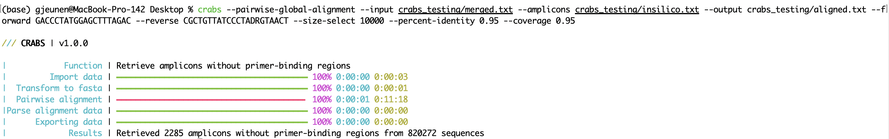

#### 5.4.1 TIP: speed up code execution for `--pairwise-global-alignment`

The `--pairwise-global-alignment` function can take a substantial amount of time to execute when CRABS is processing large sequence files, even though multithreading is supported. Since the update to CRABS *v 1.0.0*, an identical file structure is in place from `--import` to `--export`, thereby enabling functions to be executed in any order. While we still recommend to follow the order of the CRABS workflow, the `--pairwise-global-alignment` function can be significantly sped up when executing the `--dereplicate` and `--filter` functions prior to the `--in-silico-pcr` function. By executing these curation steps prior to `--in-silico-pcr`, the number of sequences needed to be processed by CRABS for the `--pairwise-global-alignment` function will be signficantly reduced.

**NOTE 1**: when executing the `--filter` function prior to `--in-silico-pcr`, please make sure to omit any parameters that are directly impacting the sequence, as `--filter` will base this on the entire sequence and not the extracted amplicon. Hence, omit the following parameters: `--minimum-length`, `--maximum-length`, `--maximum-n`.

**NOTE 2**: when executing the `--dereplicate` and `--filter` functions prior to `--in-silico-pcr`, it would be advisable to run both functions again after `--pairwise-global-alignment`, as the database could be further curated now that the amplicons are extracted.

### 5.5 Module 5: curate and subset the local database via multiple filtering parameters

Once all potential barcodes for the primer set have been extracted by the `--in-silico-pcr` and `--pairwise-global-alignment` functions, the local reference database can undergo further curation and subsetting within CRABS using various functions, including `--dereplicate`, `--filter`, and `--subset`.

#### 5.5.1 `--dereplicate`

The first curation method is to dereplicate the local reference database using the `--dereplicate` function. It is possible that for certain taxa multiple identical barcodes are contained within the local reference database at this point. This can occur when different research groups have deposited identical sequences or if the intra-specific variation between sequences for a taxon is not contained within the extracted barcode. It is best to remove these identical reference barcodes to speed up taxonomy assignment, as well as improve taxonomy assignment results (especially for taxonomic classifiers providing a limited number of results, i.e., BLAST).

The input and output files can be specified using the `--input` and `--output` parameters, respectively. CRABS offers three dereplication methods, which can be specified using the `--dereplication-method` parameter, including:

1. strict: only unique sequences will be retained irrespective of taxonomy;
2. single_species: a single sequence is retained for each species in the database;
3. uniq_species: all unique sequences are retained for each species in the database (recommended).

```{code-block} bash
crabs --dereplicate --input crabs_testing/aligned.txt --output crabs_testing/dereplicated.txt --dereplication-method 'unique_species'
```

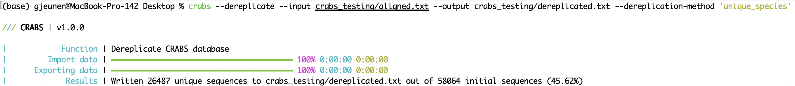

#### 5.5.2 `--filter`

The second curation method is to filter the local reference database using various parameters using the `--filter` function. The input and output files can be specified using the `--input` and `--output` parameters, respectively. From version *v 1.0.0*. CRABS incorporates the filtering based on six parameters, including:

1. `--minimum-length`: minimum sequence length for an amplicon to be retained in the database;
2. `--maximum-length`: maximum sequence length for an amplicon to be retained in the database;
3. `--maximum-n`: discard amplicons with N or more ambiguous bases (`N`);
4. `--environmental`: discard environmental sequences from the database;
5. `--no-species-id`: discard sequences for which no species name is available;
6. `--rank-na`: discard sequences with N or more unspecified taxonomic levels.

```{code-block} bash
crabs --filter --input crabs_testing/dereplicated.txt --output crabs_testing/filtered.txt --minimum-length 100 --maximum-length 300 --maximum-n 1 --environmental --no-species-id --rank-na 2
```

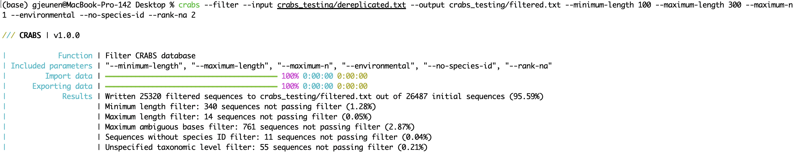

#### 5.5.3 `--subset`

The third and final curation method incorporated in CRABS is to subset the local reference database to include (parameter: `--include`) or exclude (parameter: `--exclude`) specific taxa using the `--subset` function. This function allows for the removal of reference barcodes from taxonomic groups not of interest to the research question. These taxonomic groups could have been incorporated into the local reference database due to potential unspecific amplification of the primer set. Another use-case for `--subset` is to remove known erroneous sequences.

For taxonomic classifiers based on machine learning ([IDTAXA](https://rdrr.io/bioc/DECIPHER/man/IdTaxa.html)) or k-mer distance ([SINTAX](https://www.drive5.com/sintax/)), it can be beneficial to subset the reference database by only including taxa known to occur in the region where samples were taken and exclude closely-related species known not to occur in the region to increase the obtained taxonomic resolution of these classifiers and obtain improved taxonomy assignment results.

The input and output files can be specified using the `--input` and `--output` parameters, respectively. The `--include` and `--exclude` parameters can take in either a list of taxa separated by `;` or a .txt file containing a single taxon name per line.

```{code-block} bash
crabs --subset --input crabs_testing/filtered.txt --output crabs_testing/subset.txt --include 'Chondrichthyes'
```

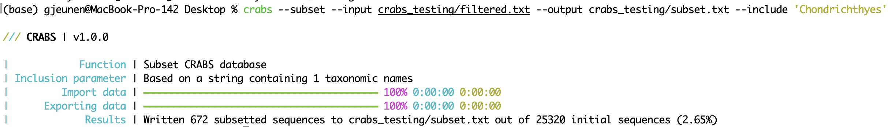

### 5.6 Module 6: export the local database

Once the reference database is finalised, it can be exported into various formats to accomodate specifications required by most software tools assigning taxonomy to metagenomic data. The input and output files can be specified using the `--input` and `--output` parameters, respectively. From version *v 1.0.0*, CRABS incorporate the formatting of the reference database for six different classifiers (parameter: `--export-format`), including:

1. `--export-format 'sintax'`: The [SINTAX](https://www.drive5.com/sintax/) classifier is incorporated into USEARCH and VSEARCH;
2. `--export-format 'rdp'`: The [RDP](https://www.ncbi.nlm.nih.gov/pmc/articles/PMC1950982/) classifier is a standalone program widely used in microbiome studies;
3. `--export-format 'qiime-fasta'` and `--export-format 'qiime-text'`: Can be used to assign a taxonomic ID in [QIIME](https://qiime2.org/) and [QIIME2](https://qiime2.org/);
4. `--export-format 'dada2-species'` and `--export-format 'dada2-taxonomy'`: Can be used to assign a taxonomic ID in [DADA2](https://benjjneb.github.io/dada2/tutorial.html);
5. `--export-format 'idt-fasta'` and `--export-format 'idt-text'`: The IDTAXA classifier is a machine learning algorithm incorporated in the [DECIPHER R package](https://rdrr.io/bioc/DECIPHER/man/IdTaxa.html);
6. `--export-format 'blast-notax'`: Creates a local BLAST reference database for [blastn](https://blast.ncbi.nlm.nih.gov/doc/blast-help/downloadblastdata.html#downloadblastdata) and [megablast](https://blast.ncbi.nlm.nih.gov/doc/blast-help/downloadblastdata.html#downloadblastdata) where the output does not provide a taxonomic ID, but lists the accession number;
7. `--export-format 'blast-tax'`: Creates a local BLAST reference database for [blastn](https://blast.ncbi.nlm.nih.gov/doc/blast-help/downloadblastdata.html#downloadblastdata) and [megablast](https://blast.ncbi.nlm.nih.gov/doc/blast-help/downloadblastdata.html#downloadblastdata) where the output provides both the taxonomic ID and accession number.

```{code-block} bash
crabs --export --input crabs_testing/subset.txt --output crabs_testing/BLAST_TAX_CHONDRICHTHYES --export-format 'blast-tax'
```

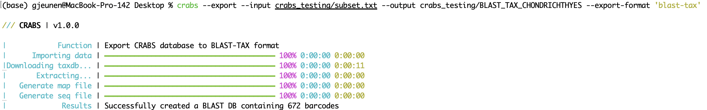

While exporting the local reference database to a single format (except for the classifiers where the reference database is split over multiple files, i.e., QIIME, DADA2, IDTAXA) will suffice for most users, a simple for loop can be written to export the local reference database to multiple formats if users would like to compare results between different taxonomic classifiers. An example is provided below to export the local reference database in SINTAX, RDP, and IDTAXA formats.

```{code-block} bash
for format in sintax.fasta rdp.fasta idt-fasta.fasta idt-text.txt; do crabs --export --input crabs_testing/subset.txt --output crabs_testing/chondrichthyes_${format} --export-format ${format%%.*}; done
```

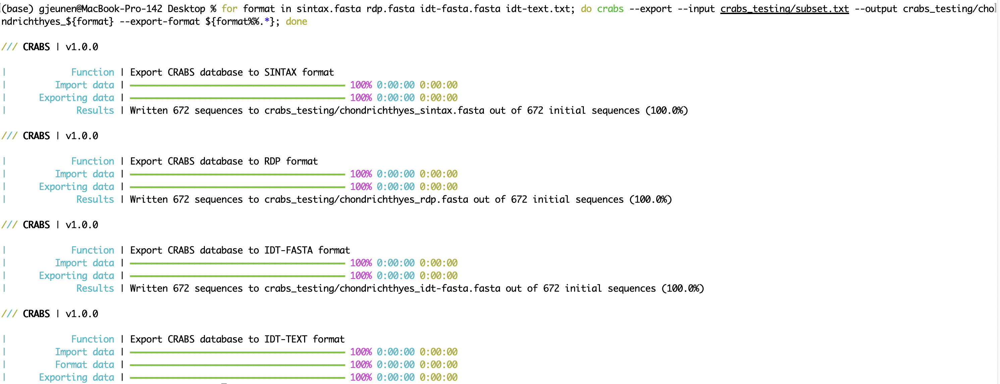

### 5.7 Module 7: post-processing functions to explore and provide a summary overview of the local reference database

Once the reference database is finalised, CRABS can run five post-processing functions to explore and provide a summary overview of the local reference database, including (i) `--diversity-figure`, (ii) `--amplicon-length-figure`, (iii) `--phylogenetic-tree`, (iv) `--amplification-efficiency-figure`, and (v) `--completeness-table`.

#### 5.7.1 `--diversity-figure`

The `--diversity-figure` function produces a horizontal bar plot with number of species (in blue) and number of sequences (in orange) per for each taxonomic group in the reference database. The user can specify the taxonomic rank to split up the reference database with the `--tax-level` parameter. The tax level is the number of the rank in which it appeared during the `--import` function. For example, if `--ranks 'superkingdom;phylum;class;order;family;genus;species'` was used during `--import` splitting based on superkingdom would require `--tax-level 1`, phylum = `--tax-level 2`, class = `--tax-level 3`, etc. The input file in CRABS format can be specified using the `--input` parameter. The figure, in .png format, will be written to the output file, which can be specified using the `--output` parameter.

```{code-block} bash
crabs --diversity-figure --input crabs_testing/subset.txt --output crabs_testing/diversity-figure.png --tax-level 4
```

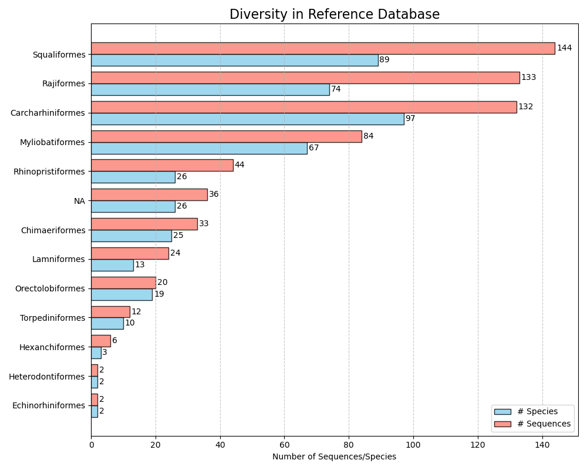

#### 5.7.2 `--amplicon-length-figure`

The `--amplicon-length-figure` function produces a line graph displaying the range of the amplicon length. The overall range in amplicon length across all sequences in the reference database is displayed in a shaded grey color, while the results split per taxonomic group (parameter: `--tax-level`) are overlayed by coloured lines. Additionally, the legend displays the number of sequences assigned to each of the taxonomic groups and the total number of sequences in the reference database. The input file in CRABS format can be specified using the `--input` parameter. The figure, in .png format, will be written to the output file, which can be specified using the `--output` parameter.

```{code-block} bash
crabs --amplicon-length-figure --input crabs_testing/subset.txt --output crabs_testing/amplicon-length-figure.png --tax-level 4
```

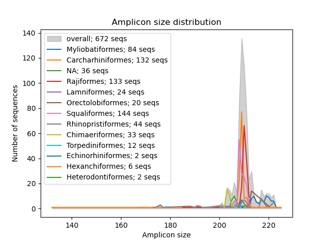

#### 5.7.3 `--phylogenetic-tree`

The `--phylogenetic-tree` function will generate a phylogenetic tree for a list of species of interest. This list of species of interest can be imported using the `--species` parameter and consists of either an input string separated by `+` or a .txt file with a single species name on each line. For each species of interest, sequences will be extracted from the reference database that share a user-defined taxonomic rank (parameter: `--tax-level`) with the species of interest. CRABS will generate an alignment of all extracted sequences using [clustalw2 v 2.1](https://anaconda.org/bioconda/clustalw) and generate a neighbour-joining phylogenetic tree using [FastTree](https://anaconda.org/bioconda/fasttree). This phylogenetic tree in newick format will be written to the output file using the `--output` parameter and can be visualised in software programs such as [FigTree](http://tree.bio.ed.ac.uk/software/figtree/) or [Geneious](https://www.geneious.com/). Since a separate phylogenetic tree will be generated for each species of interest, `--output` takes in a generic file name, while the exact output file will contain this generic name followed by '_species_name.tree'.

```{code-block} bash
crabs --phylogenetic-tree --input crabs_testing/subset.txt --output crabs_testing/phylo --tax-level 4 --species 'Carcharodon carcharias+Squalus acanthias'
```

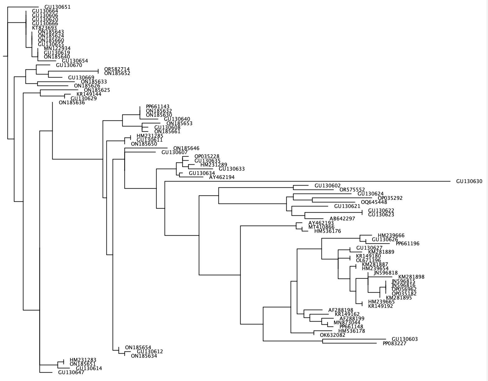

#### 5.7.4 `--amplification-efficiency-figure`

The `--amplification-efficiency-figure` function will produce a bar graph, displaying the proportion of base pair occurrence in the primer-binding regions for a user-specified taxonomic group, thereby visualizing places in the forward and reverse primer-binding regions where mismatches might be occurring in the taxonomic group of interest, potentially influencing amplification efficiency. The `--amplification-efficiency-figure` function takes a final CRABS-formatted reference database as input using the `--amplicons` parameter. To find the information on the primer-binding regions for each sequence in the input file, the initially downloaded sequences after import need to be provided using the `--input` parameter. The forward and reverse primer sequences (in 5' - 3' direction) are provided using the `--forward` and `--reverse` parameters. The name of the taxonomic group of interest can be provided using the `--tax-group` parameter and can be set at any taxonomic level that is incorporated in the input file. Finally, the figure in .png format will be written to the output file specified by the `--output` parameter.

```{code-block} bash
crabs --amplification-efficiency-figure --input crabs_testing/merged.txt --amplicons crabs_testing/subset.txt --forward GACCCTATGGAGCTTTAGAC --reverse CGCTGTTATCCCTADRGTAACT --output crabs_testing/amplification-efficiency.png --tax-group Carcharhiniformes
```


#### 5.7.5 `--completeness-table`

The `--completeness-table` function will output a tab-delimited table (parameter: `--output`) with information about a list of species of interest. This list of species of interest can be imported using the `--species` parameter and consists of either an input string separated by `+` or a .txt file with a single species name on each line. A taxonomic lineage will be generated for each species of interest using the '*names.dmp*' and '*nodes.dmp*' files downloaded using the `--download-taxonomy` function using the `--names` and `--nodes` parameters, respectively. The output table will have 10 columns providing the following information:

1. name of the species of interest
2. number of barcodes of species of interest incorporated in the reference database
3. number of species in the reference database that share the same genus
4. number of species in the genus according to the NCBI taxonomy
5. percentage of species in the genus present in the reference database
6. number of species in the reference database that share the same family
7. number of species in the family according to the NCBI taxonomy
8. percentage of species in the family present in the reference database
9. list of species sharing the same genus in the reference database
10. list of species sharing the same family in the reference database

```{code-block} bash
crabs --completeness-table --input crabs_testing/subset.txt --output crabs_testing/completeness.txt --names crabs_testing/names.dmp --nodes crabs_testing/nodes.dmp --species 'Carcharodon carcharias+Squalus acanthias'
```

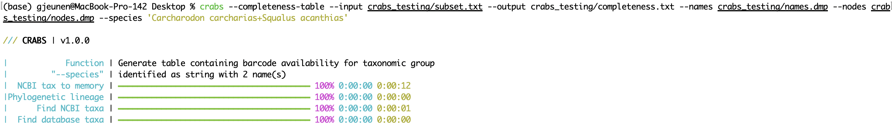

## 6. Version updates

* `crabs --version v 1.12.1`: bug fix --> automatic parsing of incorrectly-formatted sequences when exporting to BLAST format (`--export`)
* `crabs --version v 1.12.0`: support for downloading the GreenGenes2 database (`--download-greengenes2`; `--import --import-format greengenes2`)
* `crabs --version v 1.11.0`: update to the latest version of the MITOFISH database (`--download-mitofish`; `--import --import-format mitofish`)
* `crabs --version v 1.10.0`: sequences are now downloaded from BOLD V5 as standard (`--download-bold`), while BOLD V3 sequences can be downloaded through the `--version-v3` parameter (legacy). Due to the different formats between V3 and V5, `--import-format` now requires users to specify **BOLDV3** or **BOLDV5**.
* `crabs --version v 1.9.0`: support for increasing buffer size during *in silico* PCR analysis (`--in-silico-pcr --buffer-size`).
* `crabs --version v 1.8.0`: support for extracting amplicons using a single primer-binding region (`--in-silico-pcr --relaxed`).
* `crabs --version v 1.7.7`: bug fix --> fixed incorrect statement in the README documentation for the `--pairwise-global-alignment` function.
* `crabs --version v 1.7.6`: enhancement --> improved error handling for `--download-ncbi`.
* `crabs --version v 1.7.5`: bug fix --> correct processing of incorrectly formatted NCBI sequences during `--import`.
* `crabs --version v 1.7.4`: enhancement --> regex support for `--download-embl`, as well as move from FTP to HTTPS for download.
* `crabs --version v 1.7.3`: bug fix --> correct display of help documentation in the CLI due to version update for rich-click.
* `crabs --version v 1.7.2`: bug fix --> ignore non utf-8 characters when importing files (`--import`) to avoid hard crash.
* `crabs --version v 1.7.1`: bug fix --> improved error handling during  `--in-silico-pcr` when cutadapt crashes.
* `crabs --version v 1.7.0`: support for importing the GreenGenes database (`--import-format "greengenes"`).
* `crabs --version v 1.6.0`: support for downloading the GreenGenes database (`--download-greengenes`).
* `crabs --version v 1.5.0`: support for importing the UNITE database (`--import-format "unite"`).
* `crabs --version v 1.4.0`: support for importing the SILVA database (`--import-format "silva"`).
* `crabs --version v 1.3.0`: support for downloading the SILVA database (`--download-silva`).
* `crabs --version v 1.2.0`: support for importing the MIDORI2 database (`--import-format "midori"`).
* `crabs --version v 1.1.0`: support for downloading the MIDORI2 database (`--download-midori`).
* `crabs --version v 1.0.6`: bug fix --> improved parsing of BOLD headers during `--import`.
* `crabs --version v 1.0.5`: bug fix --> added a length restriction to seq ID when building BLAST databases, as needed for the BLAST+ software.
* `crabs --version v 1.0.4`: added info --> provided correct information on value input for `--pairwise-global-alignment --coverage --percent-identity`.
* `crabs --version v 1.0.3`: bug fix --> checking NCBI server response 3 times before aborting analysis.
* `crabs --version v 1.0.2`: bug fix --> capable of reporting when 0 sequences are returned after analysis.
* `crabs --version v 1.0.1`: bug fix --> successful building NCBI query using the `--species` parameter.
